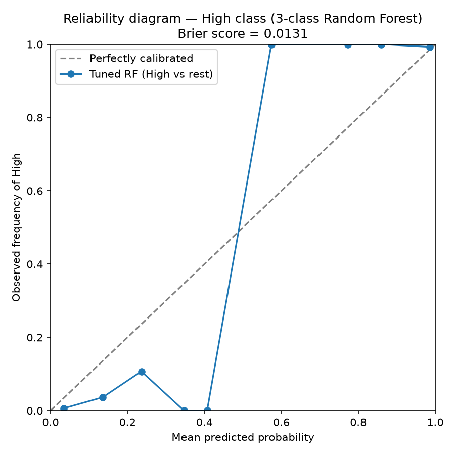
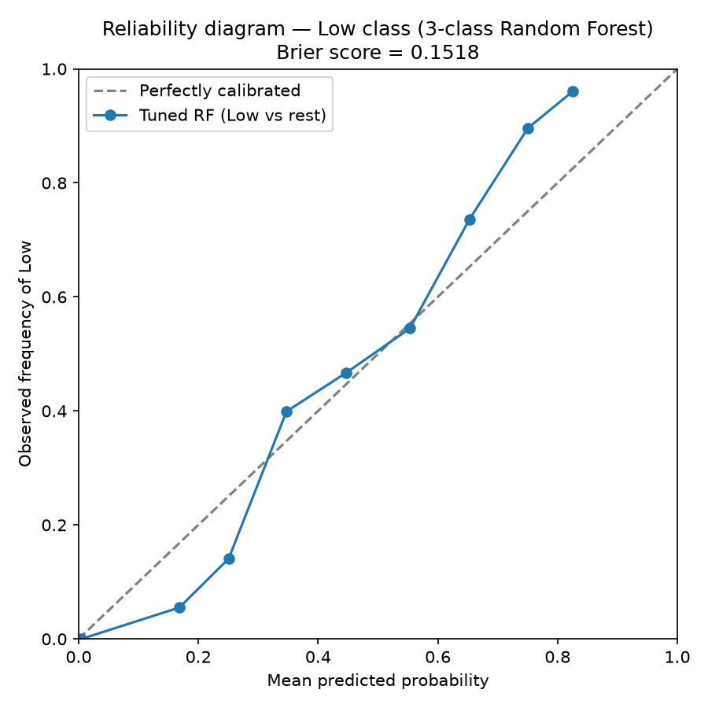
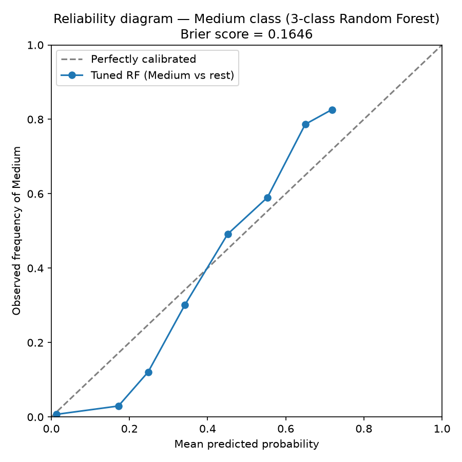

# Calibration Report (Phase 15, completing) — Tuned Random Forest, 3-Class Target
## Low and Medium Classes

## Scope

- Model: tuned Random Forest (n_estimators=200, max_depth=10, min_samples_split=10, min_samples_leaf=4, max_features='sqrt', class_weight='balanced') from `reports/tuning_results_3class.json`.
- Evaluation: `X_val`/`y_val` from `mindcare_processed_splits_3class.npz`; test set untouched.
- Validation rows: 1650; seed: 42.
- 10 uniform-width probability bins per class, one-vs-rest.
- High class already covered in `reports/calibration_3class.md` (); this report completes Low and Medium.

## Low vs Rest

**Brier score: 0.151839**

| Bin range | Mean predicted P | Actual frequency | n in bin |
|---|---:|---:|---:|
| [0.0, 0.1) | 0.0045 | 0.0000 | 148 |
| [0.1, 0.2) | 0.1682 | 0.0551 | 127 |
| [0.2, 0.3) | 0.2506 | 0.1408 | 284 |
| [0.3, 0.4) | 0.3472 | 0.3991 | 218 |
| [0.4, 0.5) | 0.4473 | 0.4672 | 137 |
| [0.5, 0.6) | 0.5533 | 0.5447 | 123 |
| [0.6, 0.7) | 0.6531 | 0.7364 | 258 |
| [0.7, 0.8) | 0.7504 | 0.8961 | 279 |
| [0.8, 0.9) | 0.8254 | 0.9605 | 76 |
| [0.9, 1.0) | — | — | 0 |

Count-weighted mean gap (predicted − actual): **-0.0238**
Count-weighted mean absolute gap: 0.0810

**Verdict: ROUGHLY CALIBRATED (predicted vs actual frequency close on average)**

## Medium vs Rest

**Brier score: 0.164572**

| Bin range | Mean predicted P | Actual frequency | n in bin |
|---|---:|---:|---:|
| [0.0, 0.1) | 0.0134 | 0.0070 | 142 |
| [0.1, 0.2) | 0.1717 | 0.0294 | 102 |
| [0.2, 0.3) | 0.2478 | 0.1208 | 298 |
| [0.3, 0.4) | 0.3417 | 0.3008 | 266 |
| [0.4, 0.5) | 0.4516 | 0.4917 | 120 |
| [0.5, 0.6) | 0.5531 | 0.5899 | 217 |
| [0.6, 0.7) | 0.6500 | 0.7867 | 436 |
| [0.7, 0.8) | 0.7182 | 0.8261 | 69 |
| [0.8, 0.9) | — | — | 0 |
| [0.9, 1.0) | — | — | 0 |

Count-weighted mean gap (predicted − actual): **-0.0095**
Count-weighted mean absolute gap: 0.0873

**Verdict: ROUGHLY CALIBRATED (predicted vs actual frequency close on average)**

## Summary Across All 3 Classes

| Class | Brier score | Weighted gap (pred − actual) | Verdict |
|---|---:|---:|---|
| Low | 0.151839 | -0.0238 | ROUGHLY CALIBRATED |
| Medium | 0.164572 | -0.0095 | ROUGHLY CALIBRATED |
| High | 0.013128 | +0.0333 | OVER-CONFIDENT (see `reports/calibration_3class.md` for the nuance: over-confident below P=0.3, well-calibrated above P=0.8) |

## Interpretation

Prototype-model metrics on a very likely synthetic dataset (see CLAUDE.md); not clinical validation.
