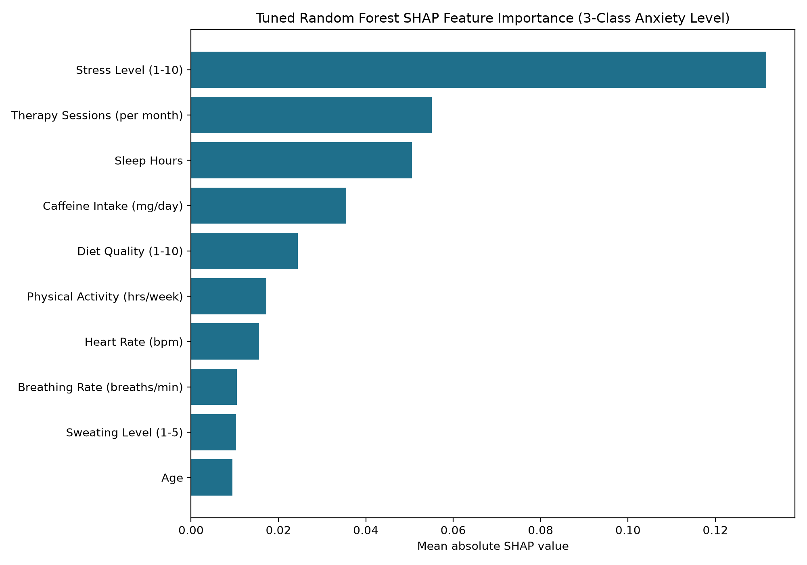

# SHAP Feature Importance Report — 3-Class Anxiety Level Target

## Scope

- Model: tuned Random Forest from `reports/tuning_results_3class.json` (n_estimators=200, max_depth=10, min_samples_split=10, min_samples_leaf=4, max_features='sqrt', class_weight='balanced').
- Training: existing `X_train`/`y_train` only.
- SHAP computed on a sample of 500 rows from `X_val` (`mindcare_processed_splits_3class.npz`); test set untouched.
- Seed: 42.

## Top 10 Features by Mean Absolute SHAP Value

| Rank | Feature | Mean |SHAP| |
|---:|---|---:|
| 1 | Stress Level (1-10) | 0.13161728 |
| 2 | Therapy Sessions (per month) | 0.05513000 |
| 3 | Sleep Hours | 0.05060564 |
| 4 | Caffeine Intake (mg/day) | 0.03547575 |
| 5 | Diet Quality (1-10) | 0.02443511 |
| 6 | Physical Activity (hrs/week) | 0.01726092 |
| 7 | Heart Rate (bpm) | 0.01560360 |
| 8 | Breathing Rate (breaths/min) | 0.01046683 |
| 9 | Sweating Level (1-5) | 0.01027403 |
| 10 | Age | 0.00944933 |

## Does Stress Level Still Dominate?

Stress Level (1-10) SHAP rank: **1 / 34**

**Yes — Stress Level still ranks #1**, but at a reduced margin over 2nd place (Therapy Sessions (per month)): 0.13161728 vs 0.05513000 (2.39x). This is consistent with CLAUDE.md's documented finding that Stress Level correlates 0.65 (ordinal) with this 3-class target, vs 0.91 with the 5-class Severity target — still the top feature, but less singularly dominant.

## Interpretation

Prototype-model metrics on a very likely synthetic dataset (see CLAUDE.md); not clinical validation. SHAP importance here is mean absolute SHAP value across all 3 classes (Low/Medium/High) and the sampled validation rows, not a single-class or single-row explanation.
